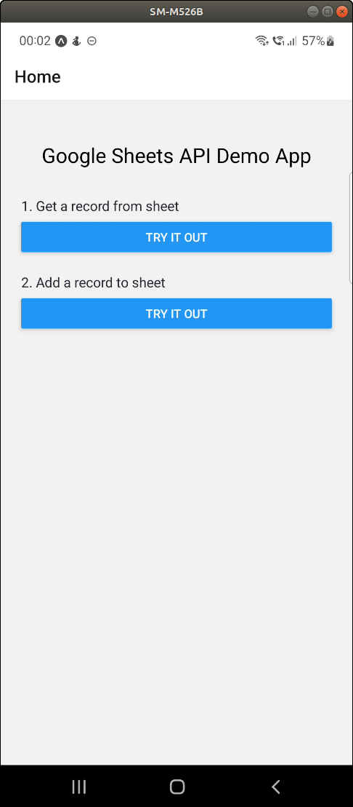
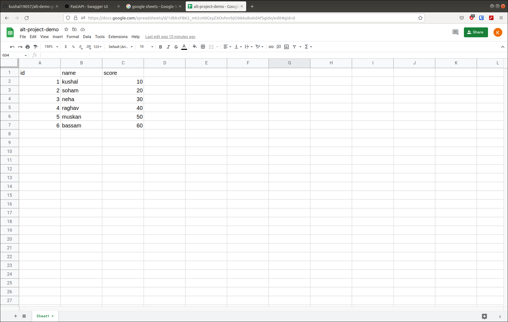

# alt-demo-google-sheets-api-react-native
- Demo app prepared using react native to show interaction with google sheets api.
- [Unlisted youtube link to demo video](#)
## About the app
- The app offers 2 functionalities :
  - Get an existing record from the google sheet
  - Add a new record to the google sheet




- The google sheet stores information of students (id, name, score). The user enters id in the text box. The app fetches details for user id 1 from google sheets and shows it to user.




### Get an existing record from the google sheet

- Input : id of user
- Output : id, name, score of user

A demo can be seen in the gif below. The left part shows google sheets webpage and the right part shows android screen.
The user enters id in the text box and clicks on submit button. The app fetches details from google sheet and shows details to user.


### Add a new record to the google sheet.

- Input : id, name, score of new user
- Output : None

A demo can be seen in the gif below. The left part shows google sheets webpage and the right part shows android screen.
The user enters id, name and score of new user. The app sends this data to google sheets and appends the records in a new row.


## Architecture

- The react app calls GET api or POST api to fastapi service.
- The fastapi service is deployed on a remote cloud server ([link to service](https://9hvbm2.deta.dev/docs)).
- The fastapi service interacts with google sheets. The below image shows API endpoints offered by the fastapi service.


- Relevant code for fastapi service (comments removed for brevity)

```python
import gspread
from oauth2client.service_account import ServiceAccountCredentials
import os
from fastapi import FastAPI
from pydantic import BaseModel

app = FastAPI()

scope = ["https://spreadsheets.google.com/feeds", 'https://www.googleapis.com/auth/spreadsheets', "https://www.googleapis.com/auth/drive.file", "https://www.googleapis.com/auth/drive"]

creds = ServiceAccountCredentials.from_json_keyfile_name("creds.json", scope)
client = gspread.authorize(creds)
sheet = client.open("alt-project-demo").sheet1

@app.get("/")
async def index():
    return {"data": "Hi there! Try the GET and POST routes :)"}

@app.get("/api/v1/get")
async def get_data():
    data = sheet.get_all_records()
    print(data)
    return {"data": data}

@app.get("/api/v1/get/{id}")
async def get_data_by_id(id: int):
    data = sheet.get_all_records()
    refined = [row for row in data if row["id"]==int(id)]
    return {'data': refined}

class User(BaseModel):
    id: int
    name: str
    score: int

@app.post("/api/v1/post/")
async def create_data(user: User):
    row = [user.id, user.name, user.score]
    sheet.append_row(row)
    return {'data': user}

```
where `creds.json` contains relevant GCP credentials.

## Acknowledgements
- Android screen capture and control done using [scrcpy](https://github.com/Genymobile/scrcpy).
- Desktop screen capture done using [obs studio](https://obsproject.com/).
- [deta.sh](https://www.deta.sh/) for providing free server hosting of fastapi service.
